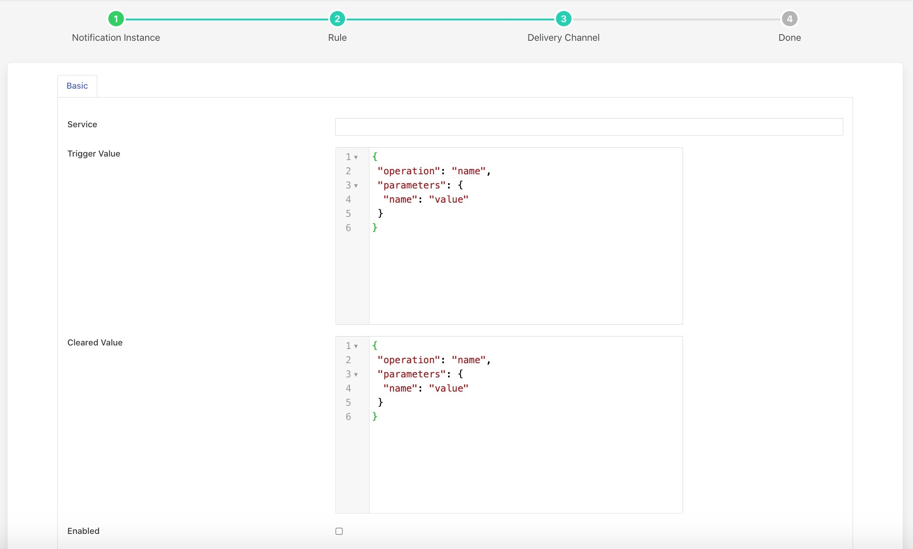

.. Images

Operation Notification
======================

The *fledge-notify-operation* notification delivery plugin is a mechanism by which a notification can be used to send a request to a south services to perform an operation.

Once you have created your notification rule and move on to the delivery mechanism

  - Select the operation plugin from the list of plugins

  - Click *Next*

    +--------------+
    | |operation_1||
    +--------------+

  - Configure the plugin

    - **Service**: The name of the south service you wish to control

    - **Trigger Value**: The operation payload to send to the south service when the rule triggers. This is the name of the operation to perform and a set of name, value pairs which are the optional parameters to pass that operations.

    - **Cleared Value**: The operation payload to send to the south service when the rule clears. This is the name of the operation to perform and a set of name, value pairs which are the optional parameters to pass that operations.

  - Enable the plugin and click *Next*

  - Complete your notification setup

Trigger Values
--------------

The **Trigger Value** and **Cleared Value** are JSON documents that are sent to the operation entry point of the south service. The format of these is a set of name and value pairs that represent the operation to execute via the south service. A simple example would be as below

.. code-block:: JSON

   {
       "operation": "ChangeFanSpeed",
       "parameters": {
          "speed" : "110"
       }
   }

In this example we are executing **ChangeFanSpeed** operation on the device with parameter **speed** to 110. In this example the values are constants defined in the plugin configuration. It is possible however to use values that are in the data that triggered the notification.

As an example of this assume we are controlling the speed of a fan based on the temperature of an item of equipment. We have a south service that is reading the temperature of the equipment, let's assume this is in an asset called **equipment** which has a data point called **temperature**. We add a filter using the **fledge-filter-expression** filter to calculate a desired fan speed. The expression we will use in this example is **desiredSpeed = temperature * 100**. This will case the asset to have a second data point called **desiredSpeed**.

We create a notification that is triggered if the **desiredSpeed** is greater than 0. The delivery mechanism will be this plugin, **fledge-notify-operation**. We want to change the speed of the fan. We set the **Trigger Value** to the following

.. code-block:: JSON

   {
       "operation" : "ChangeFanSpeed",
       "parameters": {
            "speed" : "$equipment.desiredSpeed$",
       }
    }

In this case the **speed** value will be substituted by the value of the **desiredSpeed** data point of the **equipment** asset that triggered the notification to be sent.
